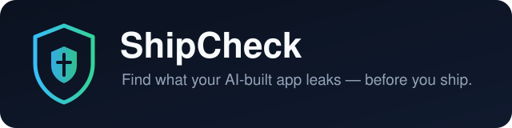

<div align="center">



**Find what your AI-built app leaks — before you ship.**

Works with Claude Code, OpenCode, Cursor, or any MCP-compatible agent — it's a standard
[Model Context Protocol](https://modelcontextprotocol.io) server, not a Claude-only tool.

[](https://github.com/n0ureldeen/shipcheck/actions/workflows/ci.yml)
[](https://www.npmjs.com/package/shipcheck-mcp)
[](./LICENSE)

</div>

---

AI coding agents happily ship apps that leak API keys, pull in GPL-licensed packages, leave admin
routes open to the internet, collect emails with no privacy policy, or touch raw card numbers —
because "does it run" and "is this okay to ship" are different questions, and your agent only
answers the first one.

ShipCheck answers the second one. It runs five fast, deterministic checks over your project and
explains every finding in plain words — what's wrong, why it matters for *you*, and exactly how to
fix it. No security background needed.

> **Honest by design:** ShipCheck flags risky *patterns*. It is not a legal review and not a
> guarantee. A clean scan means nothing matched these specific checks — nothing more.
> See [PRD.md](./PRD.md) §2 for the full non-goals.

## Two tools, two moments

| Tool | When | What it scans |
|---|---|---|
| **`scan_diff`** | **Before every commit** — while your agent builds | Just the uncommitted changes (or a whole branch via `base`). Runs in ~0.1s even on 100k-file repos. |
| **`scan_repo`** | **Before launch** — app stores, going live, investors | The whole repository, including git history for deleted-but-never-rotated secrets. |

The bundled skill teaches your agent the habit: `scan_diff` before commits, `scan_repo` before launch.

## Works with your stack

| Check | Coverage |
|---|---|
| 🔑 Exposed secrets | Any language — 15+ key formats (Stripe, OpenAI, Anthropic, OpenRouter, Supabase service-role, AWS, GitHub, Google, Slack, SendGrid, Resend, private keys, DB URLs), committed `.env` files, plus **deleted-but-never-rotated keys found in git history** |
| ⚖️ Copyleft licenses | npm · PyPI · pub.dev · crates.io · RubyGems · Composer |
| 🚪 Unlocked routes | Express · FastAPI · Flask · Next.js (App + Pages Router) · gin/echo/fiber-style Go · Laravel · Spring Boot |
| 🕵️ PII without a privacy policy | Google Analytics, PostHog, Meta Pixel, Hotjar, Clarity, Amplitude, Mixpanel, Segment, Firebase, signup/auth forms, phone inputs |
| 💳 Card data handling | Raw card/CVV fields in JS/TS/Dart/Python/HTML vs. processor SDKs (Stripe Elements & friends) |

Every summary tells you which stacks it detected (`project_types`) and warns you honestly when a
detected stack isn't fully covered (`coverage_caveat`) instead of implying everything is fine.

## What a finding looks like

> **[critical] lib/firebase_options.dart** — Possible Google API Key found in code that runs on
> people's devices.
>
> **Why this matters:** This key travels inside your app to every user's phone or browser. Anyone can
> copy it out and use it as if they were you — spending your money or reading your data.
>
> **The fix:** Move the key into a separate secrets file that never becomes part of the project, load
> it at startup, then get a new key from the provider's dashboard — treat this one as stolen.

## 30-second start

```bash
# In Claude Code:
/plugin marketplace add n0ureldeen/shipcheck
/plugin install shipcheck

# Then just talk to your agent:
```
> *"run shipcheck before I commit"* · *"is this ready to launch?"* · *"scan this repo"*

Headless / CI:
```bash
claude --plugin-dir /path/to/shipcheck -p "Run shipcheck scan_repo on . and summarize findings"
```

### Standalone MCP server (Cursor, OpenCode, anything else)

```bash
git clone https://github.com/n0ureldeen/shipcheck.git
cd shipcheck && npm install && npm run build
```

```json
{
  "mcpServers": {
    "shipcheck": { "command": "node", "args": ["/absolute/path/to/shipcheck/dist/index.js"] }
  }
}
```

Or once published: `npx shipcheck-mcp`

## Built to be trusted

- **Deterministic**: regex + dependency metadata only. An LLM explains findings downstream; it never
  decides whether a finding exists ([PRD.md](./PRD.md) §4).
- **Quiet by design**: identical keys deduplicate into one finding with all locations; output is
  severity-ordered, compact (~1k tokens on a 100k-LOC repo), capped at 100 findings with an explicit
  truncation flag; vendored trees (`node_modules`, `.venv`, `build`…) are never scanned; placeholder
  values (`mock…`, CI dummies) and public-by-design configs (`google-services.json`,
  `firebase_options.dart`) don't cry wolf.
- **Proven on real code**: dogfooded on five production repos — it caught a live Supabase
  service-role key across 13 files and three unauthenticated debug endpoints, then verified the fixes
  landed and flagged a second key that survived only in git history.
  Full true/false-positive log: [DOGFOOD_RESULTS.md](./DOGFOOD_RESULTS.md).

## Compatibility

| | |
|---|---|
| Node.js | 20+ (CI matrix: 20 & 22) |
| OS | macOS · Linux · Windows (BOM-tolerant file parsing, path-safe) |
| Agents | Anything that speaks MCP over stdio |
| Project types | Secrets/licenses cover every stack; route coverage per table above |

## Testing it yourself

```bash
npm test             # 53 unit tests
npm run e2e          # 21 real-MCP-protocol checks
npm run verify-fixture   # acceptance gate over deliberately-vulnerable fixtures
npm run dogfood -- /path/to/any/repo   # scan any repo from the CLI
```

## Contributing

Issues and PRs welcome — see [CONTRIBUTING.md](./CONTRIBUTING.md). New detector categories need both
a fires-on-risk fixture and a doesn't-over-fire regression test; false-positive reports with real
code samples are especially valuable. Real-repo results live in
[DOGFOOD_RESULTS.md](./DOGFOOD_RESULTS.md).

## License

MIT — see [LICENSE](./LICENSE).
